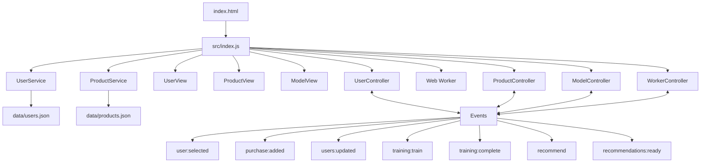

```mermaid
flowchart TD
    A[index.html] --> B[src/index.js]

    B --> C[UserService]
    B --> D[ProductService]
    B --> E[UserView]
    B --> F[ProductView]
    B --> G[ModelView]
    B --> H[WorkerController]
    B --> I[Web Worker]

    C --> J[data/users.json]
    D --> K[data/products.json]

    B --> L[UserController]
    B --> M[ProductController]
    B --> N[ModelController]

    L <--> O[Events]
    M <--> O
    N <--> O
    H <--> O

    O --> P[user:selected]
    O --> Q[purchase:added]
    O --> R[users:updated]
    O --> S[training:train]
    O --> T[training:complete]
    O --> U[recommend]
    O --> V[recommendations:ready]

```