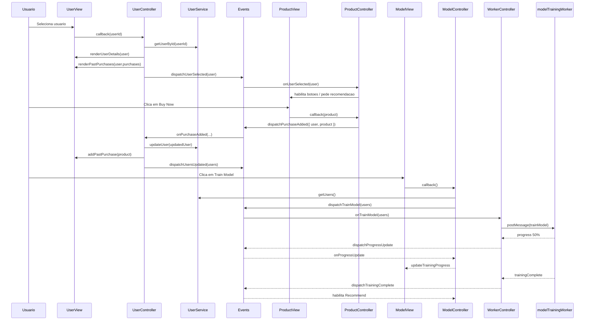

```mermaid
sequenceDiagram
    participant U as Usuario
    participant UV as UserView
    participant UC as UserController
    participant US as UserService
    participant E as Events
    participant PV as ProductView
    participant PC as ProductController
    participant MV as ModelView
    participant MC as ModelController
    participant WC as WorkerController
    participant W as modelTrainingWorker

    U->>UV: Seleciona usuario
    UV->>UC: callback(userId)
    UC->>US: getUserById(userId)
    UC->>UV: renderUserDetails(user)
    UC->>UV: renderPastPurchases(user.purchases)
    UC->>E: dispatchUserSelected(user)

    E->>PC: onUserSelected(user)
    PC->>PV: habilita botoes / pede recomendacao

    U->>PV: Clica em Buy Now
    PV->>PC: callback(product)
    PC->>E: dispatchPurchaseAdded({ user, product })

    E->>UC: onPurchaseAdded(...)
    UC->>US: updateUser(updatedUser)
    UC->>UV: addPastPurchase(product)
    UC->>E: dispatchUsersUpdated(users)

    U->>MV: Clica em Train Model
    MV->>MC: callback()
    MC->>US: getUsers()
    MC->>E: dispatchTrainModel(users)

    E->>WC: onTrainModel(users)
    WC->>W: postMessage(trainModel)

    W-->>WC: progress 50%
    WC-->>E: dispatchProgressUpdate
    E-->>MC: onProgressUpdate
    MC-->>MV: updateTrainingProgress

    W-->>WC: trainingComplete
    WC-->>E: dispatchTrainingComplete
    E-->>MC: habilita Recommend

```